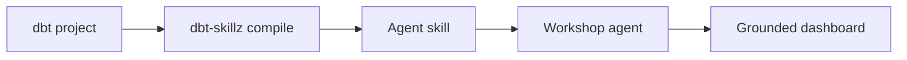
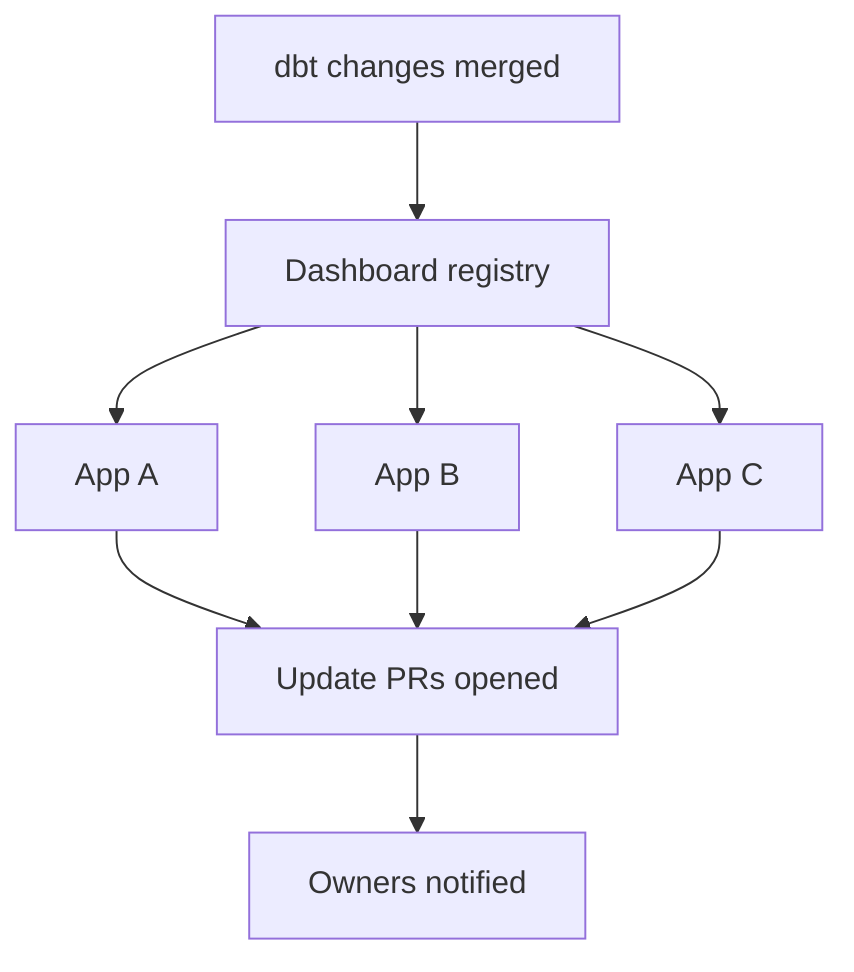

## The problem: dashboards that drift

AI coding agents can build stunning dashboards in minutes. But without access to your semantic layer, they guess at metric definitions, aggregation grain, and join logic. The result looks right, runs fine, and is quietly wrong.

As your dbt models evolve — new product lines, updated attribution models, renamed columns — agent-built dashboards don't update themselves. They were correct at the time of creation and begin drifting immediately.

## The solution: dbt-skillz + Workshop

[dbt-skillz](https://github.com/atlasfutures/dbt-skillz) is an open-source compiler (Apache 2.0) that converts your dbt project into a structured skill — a context document any coding agent can consume. Workshop is the runtime that ties it all together.



## Getting started

<Steps>
  <Step title="Install dbt-skillz">
    Install from PyPI:

    ```bash
    pip install dbt-skillz
    ```
  </Step>
  <Step title="Compile your dbt project">
    Point the compiler at your dbt project:

    ```bash
    dbt-skillz compile --project-dir ./analytics --output ./skills/data
    ```

    This generates structured skill files:
    - `SKILL.md` — entry point the agent reads first
    - `ref/sources.md` — source definitions
    - `ref/staging.md` — staging models
    - `ref/marts.md` — mart models with metric definitions
    - `ref/lineage.md` — full DAG
  </Step>
  <Step title="Import the skill into Workshop">
    Push the compiled skill to a GitHub repository (private or public). In Workshop, import the skill from the repo. The agent now has full semantic context for your data.

    See [Skills](/workshop/core-concepts/skills) for detailed import instructions.
  </Step>
  <Step title="Build your dashboard">
    Start a conversation in Workshop and reference your data. The agent uses the imported skill to write correct queries, use governed metric definitions, and respect the grain of each table.
  </Step>
</Steps>

## The trusted dashboards lifecycle

<Steps>
  <Step title="Grounded creation">
    The agent builds with full semantic context from your dbt project — correct metric definitions, proper grain, accurate join logic — from the first line of code.
  </Step>
  <Step title="Automated review on deploy">
    When a new dashboard is pushed to GitHub, a review agent audits it against the data skill — verifying metric definitions, aggregation grain, join logic, and column references before it ships.
  </Step>
  <Step title="Downstream impact analysis">
    When a dbt model changes, the system identifies every dashboard that depends on the affected models. You see the blast radius before the change merges.
  </Step>
  <Step title="Automated dashboard maintenance">
    When dbt changes are merged, an agent reviews every affected dashboard, generates pull requests with updates, and notifies the owners. Metrics stay current without manual audits.
  </Step>
</Steps>



## CI/CD integration

Use dbt-skillz in your CI pipeline to review changes to your dbt project automatically:

```yaml
# .github/workflows/dbt-review.yml
on:
  pull_request:
    paths: ['analytics/**']

jobs:
  review:
    runs-on: ubuntu-latest
    steps:
      - uses: actions/checkout@v4
      - run: pip install dbt-skillz
      - run: dbt-skillz compile --project-dir ./analytics
      - run: |
          dbt-skillz review --skill ./skills/data --diff $GITHUB_EVENT_PATH
```

The review agent uses the compiled skill as context to understand the full impact of changes and flag potential issues.

## Not just dbt

The skill compiler pattern generalizes beyond dbt. Any system that defines "what this data means" — Looker semantic models, Cube.js schemas, well-documented SQL views — can be compiled into an agent skill. dbt is where we started because it's the most structured semantic layer in the ecosystem.

Workshop also supports [SQLMesh and Dagster](/workshop/connectors/data-warehouses) natively.

## Beyond dashboards

With the compiled skill as context, product managers can describe events they want to track, have the agent instrument them in the codebase, update dbt models, and submit pull requests to the analytics team. The skill bridges domain expertise and implementation.

## Resources

<CardGroup cols={2}>
  <Card title="dbt-skillz on GitHub" icon="github" href="https://github.com/atlasfutures/dbt-skillz">
    Open-source compiler. Apache 2.0. Install with pip.
  </Card>
  <Card title="dbtskillz.com" icon="globe" href="https://dbtskillz.com">
    Project site with examples and documentation.
  </Card>
  <Card title="Build Trusted Dashboards" icon="chart-mixed" href="/workshop/build-guides/dashboards">
    Step-by-step guide to building dashboards in Workshop.
  </Card>
  <Card title="Skills Documentation" icon="brain" href="/workshop/core-concepts/skills">
    How to import and manage skills in Workshop.
  </Card>
  <Card title="Read the Blog Post" icon="newspaper" href="https://workshop.ai/blog/the-dashboard-trust-problem">
    The Dashboard Trust Problem — the full story behind trusted dashboards.
  </Card>
  <Card title="Dashboard Solution" icon="chart-bar" href="https://workshop.ai/solutions/dashboard">
    Explore dashboard capabilities on the Workshop marketing site.
  </Card>
</CardGroup>

---

<Card title="Want the full lifecycle?" icon="handshake" href="https://workshop.ai/solutions/white-glove-services">
  We work directly with teams to implement the full trusted dashboards lifecycle — from dbt skill compilation through automated review and maintenance. White-glove setup, training, and ongoing support.
</Card>
